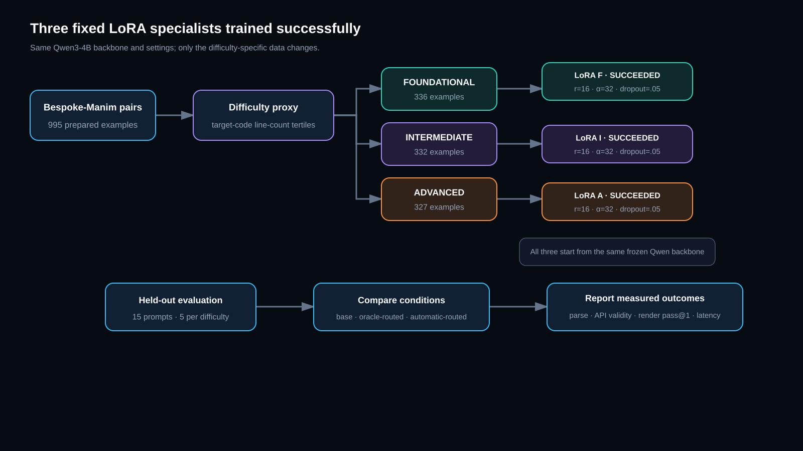

# Math Tutor

**Ask a math question. Get a narrated visual lesson.**

Some math ideas are hard to explain with another wall of text. Math Tutor turns a question into a custom animation, so learners can watch the idea unfold instead.

It can cover anything from basic geometry to calculus, Fourier transforms, and other advanced topics.

## How it works

1. Ask a question in plain English or LaTeX.
2. Pick the difficulty that feels right.
3. The model writes a Manim scene for the lesson.
4. The code is checked and rendered in an isolated container.
5. ElevenLabs adds narration that moves with the animation.

If narration fails, the silent animation can still be returned. Generated code is kept away from the main app while it runs.

## Different questions need different tutors

A first geometry lesson should not feel like a graduate analysis lecture. We use three small LoRA specialists on top of the same Qwen3-4B model:

- **Foundational** for introductory ideas.
- **Intermediate** for longer, multi-step lessons.
- **Advanced** for dense notation and higher-level topics.

The selected difficulty routes the question to its matching specialist. The specialists run through a shared Modal endpoint, so we do not need three separate copies of the full model.

For now, routing is simple and predictable. The learner chooses the level. A learned router and dynamic adapter spawning are the next research steps.

## The idea

Math explanations should feel made for the question—not pulled from a generic video library. The goal is simple: make difficult ideas easier to see, hear, and understand.
