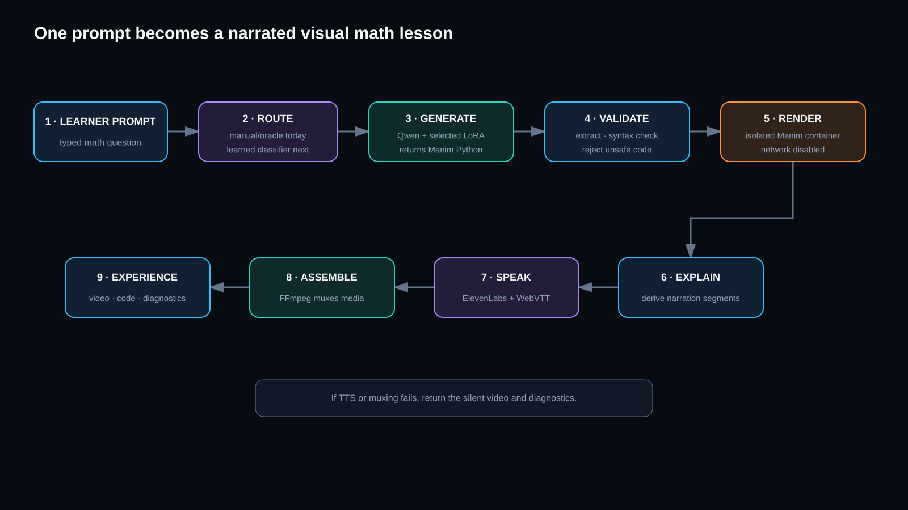

# Math Tutor

**Turn a math question into a visual, narrated lesson.**

Math Tutor helps learners understand ideas that are difficult to explain with text alone. A learner can ask about anything from the Pythagorean theorem to Fourier transforms. The product writes a visual explanation, renders it as a Manim video, and adds spoken narration and captions.

## The problem

Most AI tutors answer a math question with more text. That can work for a short calculation, but it often falls short when the learner needs to see a shape move, a graph change, or a proof unfold one step at a time.

Making a good visual lesson by hand takes time. It requires mathematical knowledge, animation code, rendering tools, and clear narration. We want to make that process available from a single prompt.

## What we are building

A learner writes a question in plain language or LaTeX. Math Tutor then:

1. Chooses a model trained for the right level of difficulty.
2. Generates an explanation and Manim animation code.
3. Checks the code before running it.
4. Renders the animation in an isolated container.
5. Adds ElevenLabs narration and captions.
6. Returns the video, explanation, source code, and routing details.

If narration or audio assembly fails, the learner still receives the silent video and useful error details. If rendering fails, the explanation and generated code remain available.

## Learning at different levels

One model should not explain every topic in exactly the same way. A basic geometry question and an advanced analysis question may need different language, pacing, and visual choices.

We start with Qwen3-4B and train three small LoRA adapters:

- **Foundational** — introductory ideas and shorter visual lessons.
- **Intermediate** — multi-step explanations and richer scenes.
- **Advanced** — denser notation, proofs, and higher-level topics.

A LoRA adapter is a small set of learned changes placed on top of the same base model. This lets us create specialists without training or storing three complete models. A router chooses one specialist for each request.

Today, these are three fixed specialists. The current route comes from the known or requested difficulty. Learning the route automatically—and deciding when a new specialist is useful—is the next research step.

## Results so far

We prepared **995 prompt-and-Manim examples** and used **895 for training** and **100 for validation**. All three specialist training jobs completed successfully.

| Specialist | Training examples | Validation examples | First validation loss | Final validation loss |
| --- | ---: | ---: | ---: | ---: |
| Foundational | 302 | 34 | 0.668 | **0.494** |
| Intermediate | 299 | 33 | 0.566 | **0.457** |
| Advanced | 294 | 33 | 0.510 | **0.435** |

Lower validation loss means the model became better at matching the held-out examples. These numbers show that training worked; they do **not** yet prove that every generated video is correct. Our next evaluation measures whether the code parses, follows the lesson request, and renders successfully on the first attempt.

## Why this approach matters

- **Visual first:** the answer is an animation, not only a block of text.
- **Broad subject range:** the product is intended for both foundational and advanced mathematics.
- **Specialized explanations:** each request can use the model best suited to its difficulty.
- **Safer execution:** generated Python is checked and rendered without network access.
- **Useful fallbacks:** one failed step does not have to erase the rest of the lesson.
- **Visible reasoning path:** the interface can show which specialist handled the request.

## Current state

The web experience, FastAPI service, Manim rendering, ElevenLabs narration, captions, and three trained LoRA adapters are in place. We are connecting the adapters to a GPU inference service and measuring their effect on code quality and render success.

## Built with

Qwen3-4B · LoRA · FastAPI · React · Manim · ElevenLabs · Docker · FFmpeg
